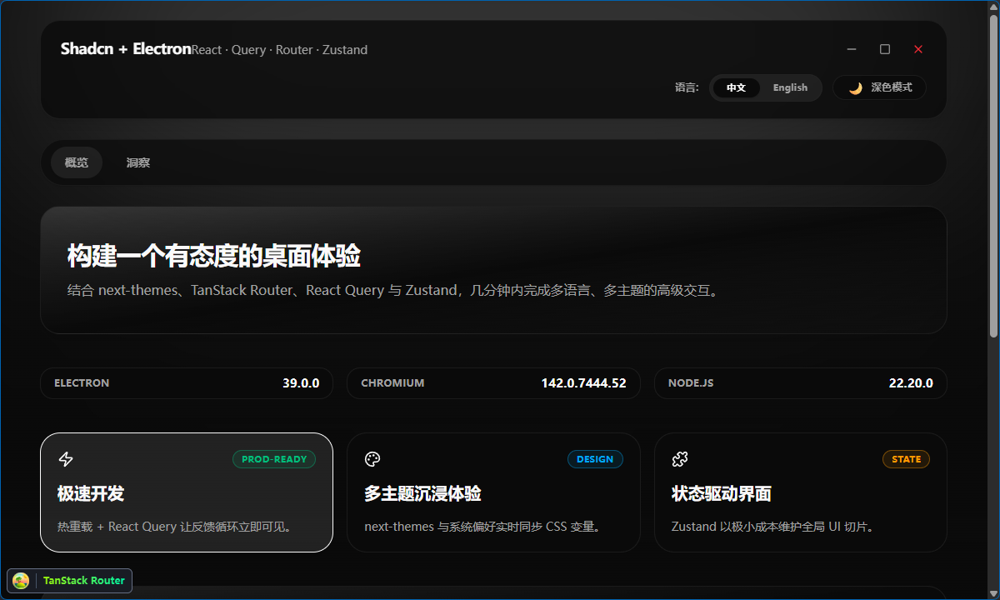

# electron-webpack-shadcn

Modern Electron + React desktop starter powered by Electron Forge, Webpack, shadcn/ui, and the latest TypeScript toolchain.




---
## 🧱 Tech Stack
- **Electron 39 + Forge**: multi-platform packaging with NSIS, deb, rpm, and zip makers configured in `forge.config.ts`.
- **Webpack plugin**: splits builds for `src/main`, `src/preload`, and `src/renderer`, emitting to `.webpack/` in dev and `dist/` for releases.
- **React 19 + shadcn/ui + Radix Primitives**: themeable UI components with Tailwind CSS v4, lucide icons, and TanStack Router/Query for routing/data.
- **Quality tooling**: ESLint + Biome for linting/formatting, Vitest + Testing Library for renderer tests, and TypeScript strict mode for shared IPC contracts.

## 🚀 Getting Started
```bash
npm install
npm run start    # forge dev server + live reload renderer
```
Use the `justfile` targets if you prefer `just start`, but standard npm scripts cover every workflow.

## 📁 Project Structure
- `src/main` – Electron main process, app lifecycle, and Forge hooks.
- `src/preload` – secure bridges exposed via `contextBridge`.
- `src/renderer` – React app entry; components from `src/components` and utilities in `src/lib`/`src/hooks`.
- `.webpack/` – transient build output while dev server runs; safe to delete.
- `dist/` – distributable artifacts generated by `npm run make`.

## 📜 Scripts & Tooling
- `npm run start` – hot reload desktop app in development.
- `npm run package` / `npm run make` / `npm run bundle` – create installers or zipped builds.
- `npm run lint` / `npm run fix` – lint or auto-fix with ESLint/Biome.
- `npm run type-check` – TS compile without emitting to ensure preload/main stay in sync.
- `npm run test` – Vitest suite (jsdom) for renderer logic.
- `npm run taze` – upgrade dependencies, excluding Electron fuses and Recharts.
- `npm run shadcn` – add components from shadcn/ui via the curated `components.json`.

## 🧪 Testing & QA
Place renderer specs next to components (e.g., `Button.test.tsx`) or inside `__tests__`. Mock preload APIs via the provided TypeScript contracts. Run `npm run lint && npm run test` before opening a PR and document any gaps.

## 🤝 Contributing
- Keep commits concise, e.g., `feat: add auto-update banner`.
- Include screenshots/gifs for UI changes and list scripts executed.
- Never store secrets in the repo; leverage `.env` files (gitignored) and read them only inside the main process/preload.
